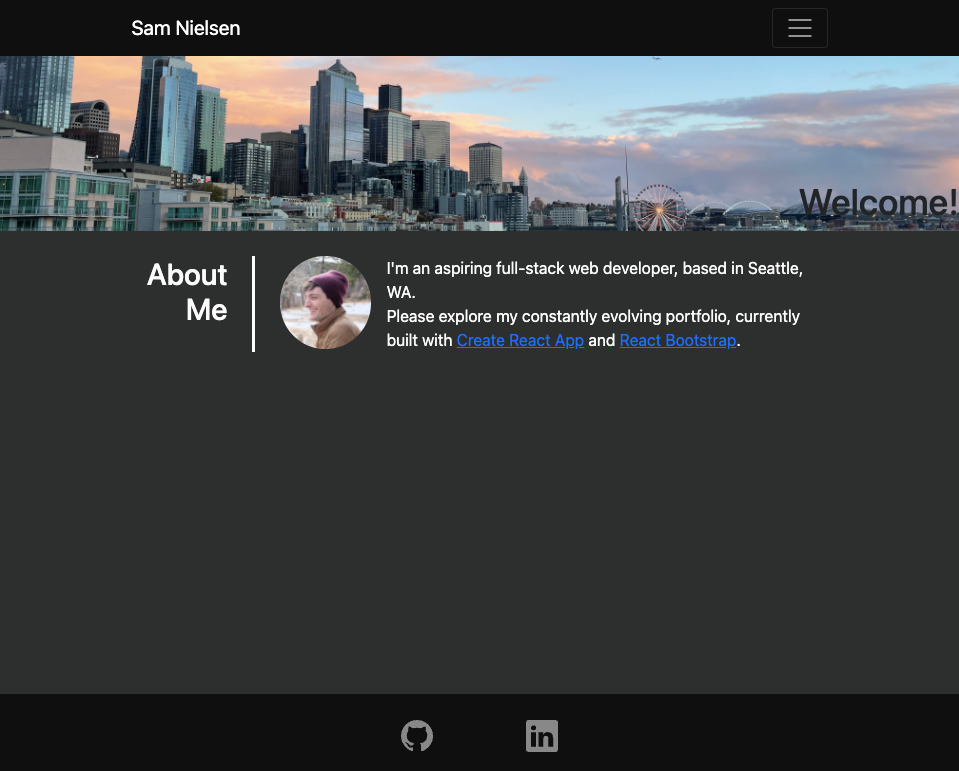

# sammn721.github.io 
My web development portfolio, rebuilt with [Create React App](https://create-react-app.dev/) and [React Bootstrap](https://react-bootstrap.github.io/). This version will showcase the progress I've made over the last six months.

## Table of Contents
1. [Installation](#installation)
2. [Usage](#usage)
3. [License](#license)
4. [Contributing](#contributing)
5. [Questions](#questions)

## Installation
Visit [my portfolio](https://sammn721.github.io).

## Usage
Click stuff! 

## License
This project is [MIT](https://opensource.org/licenses/MIT) licensed.

## Contributing
hmu in the contact tab!

## Questions
Additional questions? Please contact me at sammn721@gmail.com!
For more projects, please visit my [GitHub profile](https://github.com/sammn721).
